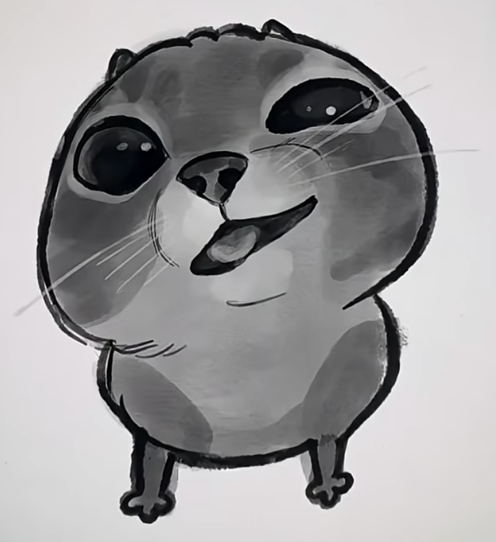

# Rixētranzlātr (Rixietranslater)

Welcome to the **Rixētranzlātr** project!
This tool was inspired by Rixie, — a very smart girl, actually, the creator of **Rixēspēk** — a very mysterious and unintelligible way to write English that almost nobody can decode (the best writing system in the entire omniverse, actually). Despite the challenge, I decided to build a translator for Rixēspēk, but Rixie told me not to show this to anyone, so this repository is private and contains a very secret technology, top secret, actually.

---

## About This Project

- **Rixēspēk** is a secret code.
- **Rixētranzlātr** is my attempt to translate Rixēspēk back into English.
- Reverse translation (English → Rixēspēk) is planned for the future.
- This is a very secret technology.
  **If you are not me or Rixie, don’t try to use it, or I'll bite you! >:(**

> Ya, actually, I can understand Rixēspēk, but it's difficult.

---

## Kat silē (cat silly)

By the way, this is Kat silē. Hehehe...
\>:3

_Yup, Kat silē (a meme from our Discord server). They're a very cute and silly cat, actually._

---

## Disclaimer

This repository is private and for fun.
Please respect the secrecy of the project!

---

## The Official Rixēletrz

### Vowels

- **u:** /ʌ/ or /ɜ:/ or /ə/
- **i:** /ɪ/
- **e:** /e/
- **o:** /ɒ/ or /ɔ:/
- **a:** /ɑ/ or /æ/
- **skip in the middle of a word after a consonant:** /ə/
- **ē:** /i:/
- **ł:** /u:/
- **œ:** /ʊ/

### Diphthongs

- **ī:** /ɑɪ/
- **ā:** /eɪ/
- **ō:** /əʊ/
- **ū:** /ju/

### Consonants

- **s:** /s/ or (/z/ after a vowel or voiced consonant)
- **t:** /t/
- **b:** /b/
- **p:** /p/
- **k:** /k/
- **d:** /d/
- **f:** /f/
- **g:** /g/
- **h:** /h/
- **j:** /dʒ/
- **l:** /l/
- **m:** /m/
- **n:** /n/
- **r:** /r/
- **v:** /v/
- **w:** /w/
- **ng:** /ŋ/
- **q:** /ʃ/
- **q:** /ʒ/
- **c:** /ʧ/
- **th:** /θ/ or /ð/
- **y:** /j/
- **x:** /ks/
